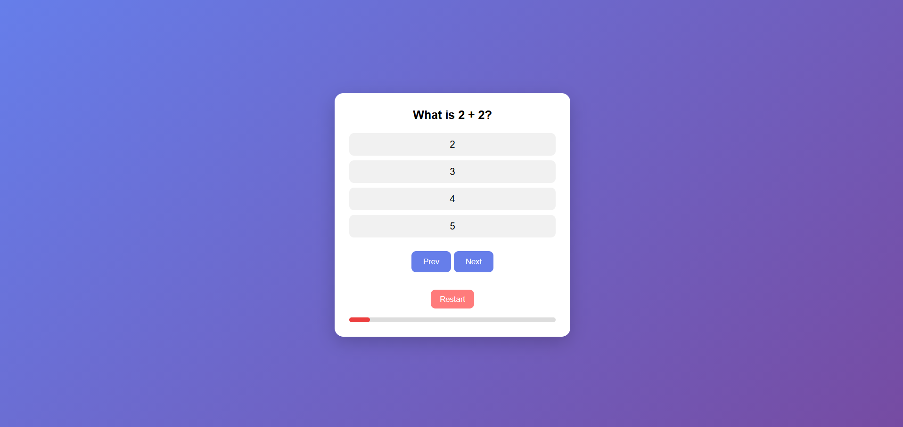

# 🧠 Quiz App

A modern and interactive **Quiz App** built using **HTML, CSS, and JavaScript**. The application presents multiple-choice questions with smooth navigation, a progress tracker, and restart functionality, providing an engaging learning experience.

---

## 🚀 Live Demo

🔗 https://quiz-sainath-app.netlify.app/

---

## 📸 Preview



---

## ✨ Features

* 📝 Multiple-choice quiz questions
* ✅ Select one answer per question
* ⏭️ Next question navigation
* ⏮️ Previous question navigation
* 🔄 Restart quiz anytime
* 📊 Progress bar to track completion
* 🎨 Clean and responsive user interface
* ⚡ Smooth user experience
* 🏆 Final score calculation
* ✔️ Correct and incorrect answer feedback

---

## 🛠️ Built With

* HTML5
* CSS3
* JavaScript (ES6)

---

## 📂 Project Structure

```text
quiz-app/
│
├── index.html
├── style.css
├── script.js
├── screenshot.png
└── README.md
```

---

## 🧠 What I Learned

This project helped me improve my understanding of:

* DOM Manipulation
* Event Handling
* Arrays & Objects
* Conditional Logic
* Dynamic Rendering
* State Management
* Progress Tracking
* Responsive Web Design

---

## ▶️ Getting Started

1. Clone the repository

```bash
https://github.com/sairaj-086/Quiz-app
```

2. Open the project folder.

3. Open **index.html** in browser.

---

## 📌 Key Functionalities

✔ Multiple Choice Questions

✔ Next & Previous Navigation

✔ Progress Bar

✔ Restart Quiz

✔ Responsive UI

✔ Interactive User Experience

✔ Score Calculation

✔ Answer Validation

---

## 🚀 Future Improvements

* ⏱️ Timer for each question
* 🏆 Leaderboard
* 📂 Multiple quiz categories
* 🎵 Sound effects
* 🌙 Dark mode
* 📈 Performance analytics
* 💾 Save high scores using Local Storage
* 🌐 Fetch quiz questions from an API

---

## 👨‍💻 Author

**Sairaj**

Feel free to explore the project, suggest improvements, or contribute.

If you enjoyed this project, don't forget to ⭐ the repository!

